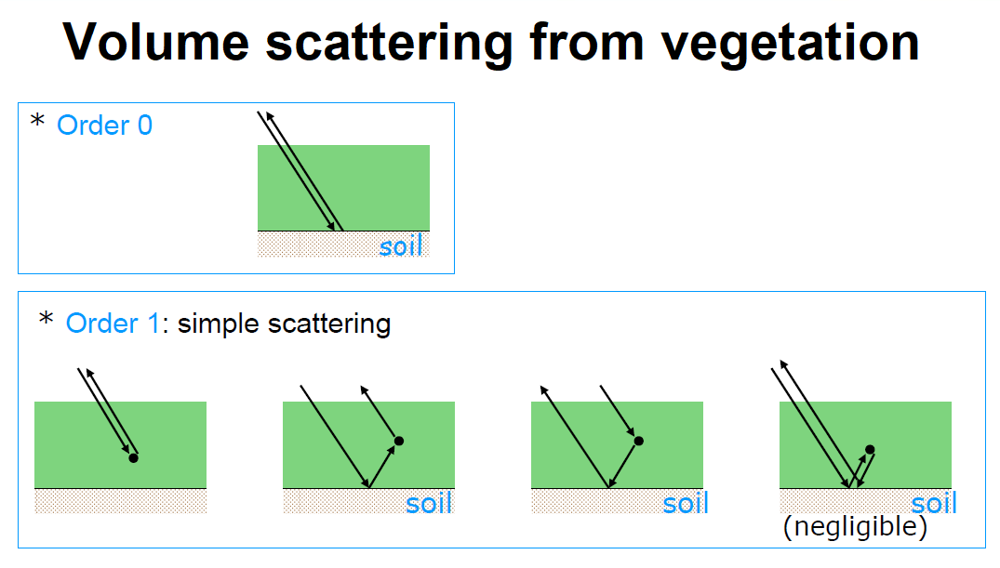
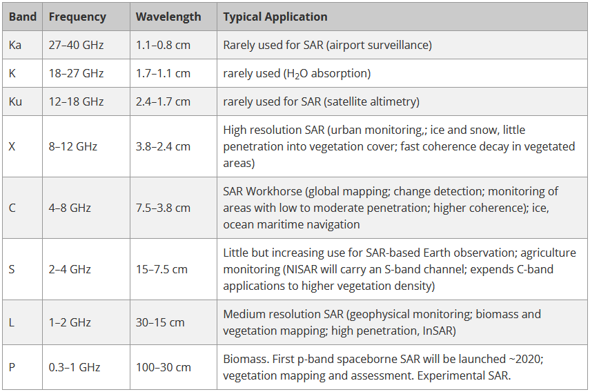

# Scattering mechanisms
The backscattered signal results from:
-	surface scattering

-	volume scattering

-	multiple volume-surface scattering

The relative importance of these contributions depend on
-	surface roughness

-	dielectric properties of the medium

All of these factors depend on
-	the radar frequency
-	the polarisation
-	the incidence angle

## The radar frequency
Wavelength determines how the radar signal interacts with the surface and how far a signal can penetrate into a medium. For example, an X-band radar, which operates at a wavelength of about 3 cm, has very little capability to penetrate into broadleaf forest, and thus mostly interacts with leaves at the top of the tree canopy. An L-band signal, on the other hand, has a wavelength of about 23 cm, achieving greater penetration into a forest and allowing for more interaction between the radar signal and large branches and tree trunks. Wavelength doesn't just impact the penetration depth into forests, but also into other land cover types such as soil and ice.

Commonly used microwave bands and their SAR applications are listed in a table below.

## The polarisation
Radar collect signals in different polarizations. Polarization refers to the orientation of the plane in which the transmitted electromagnetic wave oscillates. While the orientation can occur at any angle, SAR sensors typically transmit linearly polarized. The horizontal polarization is indicated by the letter H, and the vertical polarization is indicated by V.

The advantage of radar sensors is that signal polarization can be precisely controlled on both transmit and receive. Signals emitted in vertical (V) and received in horizontal (H) polarization would be indicated by a VH. Alternatively, a signal that was emitted in horizontal (H) and received in horizontal (H) would be indicated by HH, and so on. Examining the signal strength from these different polarizations carries information about the structure of the imaged surface, based on the following types of scattering: rough surface, volume, and double bounce. For visualisation, see the figure below.

- Rough surface scattering, such as that caused by bare soil or water, is most sensitive to VV scattering.
- Volume scattering, for example, caused by the leaves and branches in a forest canopy, is most sensitive to cross-polarized data like VH or HV.
- The last type of scattering, double bounce, is caused by buildings, tree trunks, or inundated vegetation and is most sensitive to an HH polarized signal.

# SAR Polarimetry
Targets on the ground have distinctive polarisation signatures reflecting different polarisations with different intensities and converting one polarisation into another. For example, volume scatterers (e.g. forest canopy) have different polarisation properties than surface scatterers (e.g. sea surface).

Polarimetry can be used to separate different scattering contributions and can then be used to extract information about the scattering process. The polarimetry input is intensities only.

Applications of polarimetry include:
- agriculture: crop type identification, crop condition monitoring, soil moisture measurement
- forestry: biomass estimation, species identification and fire scar mapping
- hydrology: monitoring wetlands and snow cover
- oceanography: sea ice identification, coastal wind field measurement, oil spill detection
- security: ship detection and classification

# SAR Interferometry
A SAR signal contains amplitude and phase information. Amplitude is the strength of the radar response. The phase of the SAR image is determined primarily by the distance between the satellite antenna and the ground targets.

Interferometric SAR (InSAR) exploits the phase difference between two complex radar SAR observations of the same area, taken from slightly different sensor positions, and extracts distance information about the Earth's terrain. By combining the phase of these two images after coregistration, an interferogram can be generated where phase is highly correlated to the terrain topography and deformation patterns can be mapped.

Applications of InSAR include:
- geophysical monitoring of natural hazards: earthquakes, volcanoes and landslides
-	time-series analysis of surface deformation: subsidence and structural stability
-	glacier motion analysis
-	digital elevation mapping.
