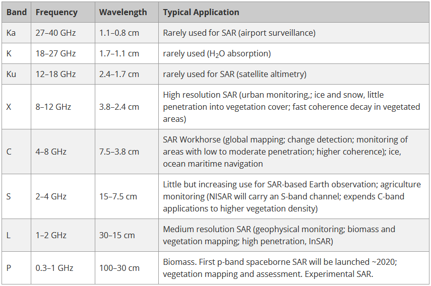

Extensive list of satellite missions - https://directory.eoportal.org/web/eoportal/satellite-missions/a

# SAR Missions
- Sentinel 1 https://sentinels.copernicus.eu/web/sentinel/missions/sentinel-1
  - C-band
  - still operational
  - Sentinel-1A
    - launched 2014
  - Sentinel-1B
    - launched 2016
- ERS https://earth.esa.int/eogateway/missions/ers
  - ERS-1
   - launched 1991, ended 2000
  - ERS-2
    - launched 1995, ended 2011
- ENVISAT https://earth.esa.int/eogateway/missions/envisat
  - C-band
  - launched on 2002, ended 2012
  - ERS successor
- ALOS-1
  - launched 2006, ended 2011
  - L-Band
  - Japanese
- ALOS-2
  - Japanese
- TerraSAR-X and TanDEM-X https://earth.esa.int/eogateway/missions/terrasar-x-and-tandem-x
  - X-band
  - launched 2007, still operational
  - German
- COSMO-SkyMed https://earth.esa.int/eogateway/missions/cosmo-skymedrada
  - constellation consisting of four identical satellites launched between 2007 and 2010
  - Italian
  - still operational
  - X-band
- RADARSAT-1 https://www.asc-csa.gc.ca/eng/satellites/radarsat/technical-features/radarsat-comparison.asp
  - launched 1995, ended 2013
  - C-band
- RADARSAT-2 https://www.asc-csa.gc.ca/eng/satellites/radarsat/technical-features/radarsat-comparison.asp
  - launched 2017
  - C-band
  - Canadian
  - 2007
- RADARSAT constellation https://www.asc-csa.gc.ca/eng/satellites/radarsat/technical-features/radarsat-comparison.asp
  - launched 2019
  - C-band
  - Canadian
- JERS-1 https://earth.esa.int/eogateway/missions/jers-1
  - launched 1992, ended 1998
  - L-band
  - Japanese
- KOMPSAT-5
  - launched 2013
  - X-band
  - Korean
- UAVSAR https://asf.alaska.edu/data-sets/sar-data-sets/uavsar/
  - in operation since 2008
  - airborne repeat-track SAR data
  - L-band
- Gaofen-3
  - C-band
  - Chinese
- RISAT
  - C-band
  - Indian
- ALOS-4 / PALSAR-3
- BIOMASS
- SAOCOM
- NISAR
- NOVASAR-S
- RCM / RADARSAT-3
- TerraSAR-L

# Bands explanation
  
  
