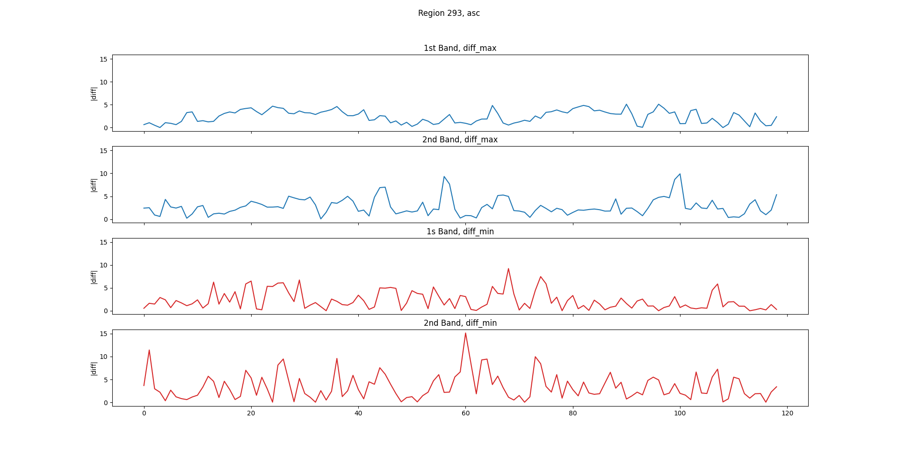
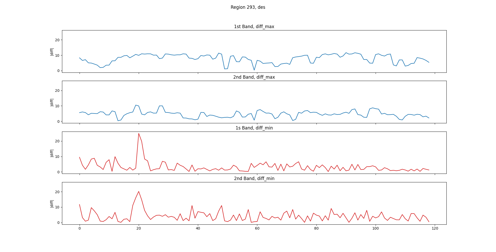

# Data products
SENTINEL-1 data products distributed by ESA include:
- Raw Level-0 data (for specific usage)
- Processed Level-1 Single Look Complex (SLC) data
  - complex imagery with amplitude and phase
  - distribution limited to specific relevant areas
- Ground Range Detected (GRD) Level-1 data with multi-looked intensity only
  - systematically distributed
- Level-2 Ocean (OCN) data for retrieved geophysical parameters of the ocean
  - systematically distributed

# Data acquisition modes
Sentinel-1 operates in four exclusive acquisition modes:
- Stripmap (SM)
  - available on request, used for extraordinary events such as emergencies
- Interferometric Wide swath (IW)
  - the primary mode over land
- Extra-Wide swath (EW)
  - used for wide area coastal monitoring including ship traffic, oil spill and sea-ice monitoring
- Wave (WV)
  - the primary mode over open ocean

# Data explanation
Sentinel-1 measures radar backscatter measurements. Each pixel’s value represents the backscatter coefficient at that given location at the time the image was taken. Because this coefficient can vary by several orders of magnitude, it is converted to decibels as 10*log10 σ°. Nevertheless, the raw values can also be acquired using the "COPERNICUS/S1_GRD_FLOAT" dataset.

The backscatter of an area depends on the terrain structure, surface roughness and the dielectric constant of the materials on the ground. Generally, the more roughness or structure on the ground, the greater the backscatter. Greater backscatter results in the area that appears like a bright feature in the image. On the other hand, flat surfaces reflect the signal away resulting in a dark feature.

The dielectric constant indicates the reflectivity and conductivity of materials. In the microwave region of the spectrum, most natural materials have a dielectric constant in the range of 3 to 8 when dry, whereas water has a dielectric constant of approximately 80. Therefore, the presence of moisture in soil and vegetation results in significant reflectivity.

Despite the influence the water has on the backscatter measurements, isolation of the soil moisture levels from a single backscatter value is currently an ongoing research problem. From my quick look at the papers on the topic, quite often the solutions to this are model-based.

# Data filtering
Sentinel-1 data is collected with several different instrument configurations, resolutions, band combinations and during both ascending and descending orbits. Because of this heterogeneity, the data must be filtered down into a homogeneous subset. The common metadata fields used for filtering available on Google's Earth Engine are:
- transmitter-receiver polarisation
 - 'VV', 'HH', 'VV + VH', 'HH + HV'
- instrument mode
  - 'SM', 'IW', 'EW', 'WV'
- orbit pass
  - 'ASCENDING', 'DESCENDING'
- resolution_meters
  - 10, 25, 40 meters
- resolution
  - 'M' (medium) or 'H' (high)

However, these metadata fields cannot be arbitrary combined. Selecting an instrument mode automatically defines other metadata fields. For example, specifying that the data should come from 'IW' mode will set transmitter-receiver polarisation to 'VV+VH', resolution_meters to '10', and resolution to 'H'. Still, the orbit pass is defined by the user as the direction of travel changes the perceived roughness of a surface, resulting in different readings for 'ASCENDING' and 'DESCENDING' pass.

More general information on SAR data can be found [here](SAR_data_general.md).

# Statistics collected on a sample region 293
Data was collected from a log dataset, i.e. "COPERNICUS/S1_GRD". The graph visualises the absolute difference, |diff|, between the max and min value of the two consecutive samples. The first band refers to vertical polarisation data "V", second band is a horizontal polarisation data "H". The first graph is for the ascending pass, the second graph is for the descending pass.  

